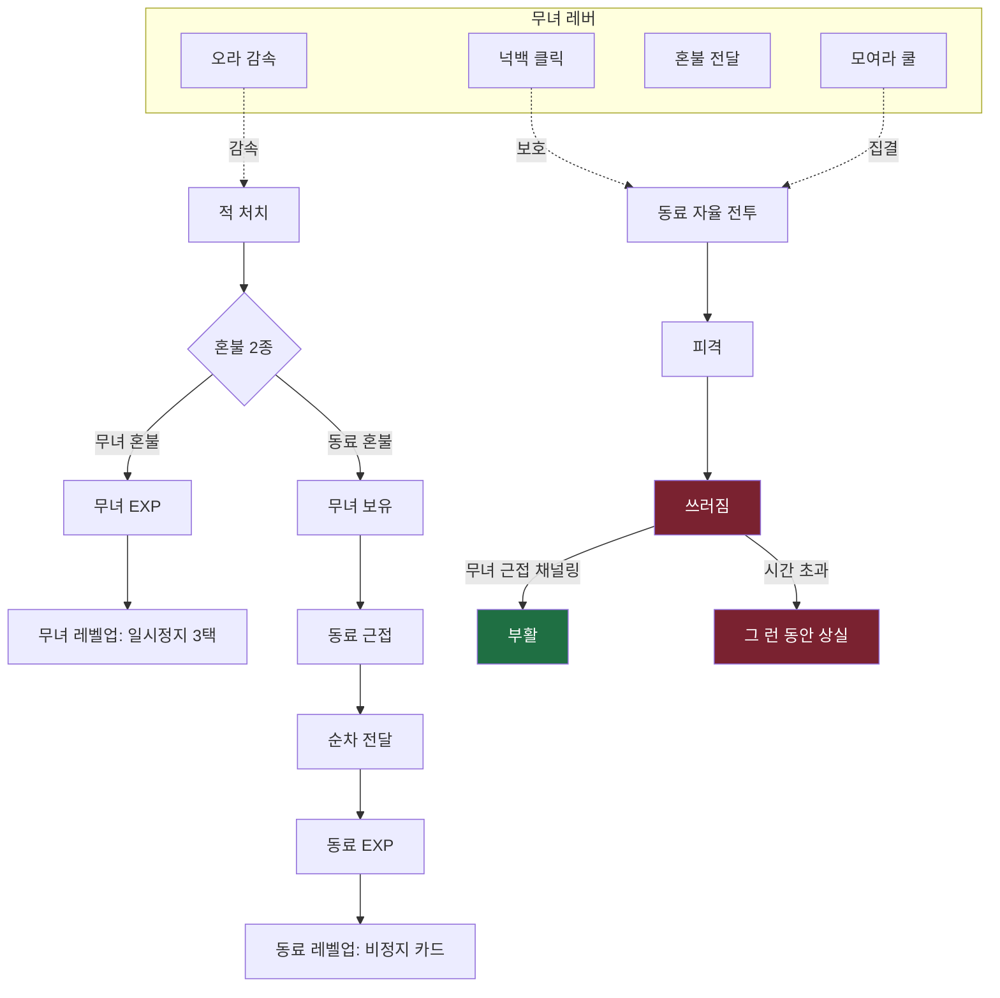

# 00. 개요 · 결정 로그 · 용어집

> 가제: **무녀: 밤을 부르는 자**
> 이 문서 묶음(`docs/`)은 `DESIGN.md`(컨셉)를 **구현 가능한 설계**로 옮긴 것이다.
> 컨셉은 `DESIGN.md`가, 결정의 "왜/무엇"은 이 묶음이 권위를 가진다. 충돌 시 이 묶음이 우선한다.

---

## 1. 한 줄 정체성

조선의 무녀가 **직접 싸우지 않고**, 자율적으로 싸우는 동료들을 **포지셔닝·넉백·혼불 배분·집결**으로 지휘하고 살려내는 **데이터 주도 호드 서바이벌 로그라이트**.

핵심 설계 명제 한 줄: **"무녀는 딜이 없다. 모든 화력은 동료에게서 나오고, 그 동료를 살리는 것이 게임이다."**

---

## 2. 결정 로그 (Decision Log)

그릴링으로 확정된 결정. 각 항목은 되돌리기 비용이 크다. 변경 시 영향 문서를 함께 갱신할 것.

| # | 분야 | 결정 | 비고 |
|---|------|------|------|
| D1 | 엔진 | **Godot 4 / GDScript 주력** | C#는 성능 병목 실측 시에만 부분 도입 |
| D2 | 시점 | **2D 탑다운 스프라이트** | 3D 아니다. 화려함은 셰이더·파티클·스프라이트 애니로 |
| D3 | 플랫폼 | **PC 우선 + 모바일 이식 가능** | 입력을 추상 레이어로 설계 (D5) |
| D4 | 범위 | **데이터 주도 + 수직 슬라이스 먼저**, 저작 도구 UI는 검증 후 | [07] 참조 |
| D5 | 입력 | 추상 3종: `이동 벡터` / `조준 클릭 위치` / `명령 트리거` | PC·모바일 공통 |
| D6 | 무녀 | **무공격 순수 서포터.** 레버 4개(오라·「물렀거라」·혼불전달·모여라)만 | [01] |
| D6-a | 무녀 생존 | **무녀에게 HP 있음(시작 100). 무녀 사망=즉시 패배.** 적 접촉 피해를 받음, 생존 카드로 HP↑ | [01]§7 (무적 결정 폐기) |
| D7 | 무녀 성장 | 레벨업 시 **서포터/컨트롤만** 강화. 공격 주술 없음 | DESIGN §11의 공격 주술은 폐기/동료용 재해석 |
| D8 | 명령 | **"모여라" 단일**(쿨다운 액티브). DESIGN §9의 스탠스 5종 폐기 | 지속↑·쿨↓ 업그레이드 |
| D9 | 동료 AI | **역할대로 교전, 자가후퇴 거의 없음.** 생존은 플레이어 책임 | 원딜 카이팅만 예외 [02] |
| D10 | 혼불 | **2종**: 무녀 혼불(즉시 흡수) / 동료 혼불(보유→근접 시 **자동** 전달, **가까울수록 빠름**). 전달은 **EXP + 소폭 HP 회복** 겸함 | [03] |
| D11 | 성장 선택 | **무녀·동료 모두 레벨업 3택** | 빌드 깊이 최대 |
| D12 | 선택 흐름 | **무녀 3택 = 일시정지 / 동료 3택 = 비정지 보류 카드** | 흐름 끊김 방지 [03] |
| D13 | 부활 | **무녀 근접 채널링** (곁에 머물면 부활 게이지↑) | 혼불 전달과 같은 패러다임 [02] |
| D14 | 런 구조 | **시간제 생존 + 데이터 목표 모듈** | [04][05] |
| D15 | 메타 | **스테이지 해금 + 가벼운 영구메타 + 런내 빌드 리셋** | [03] |
| D16 | 편성 | 런 시작 전 **출전 편성**(해금 풀에서 선택), 슬롯 **시작 2 → 메타 최대 4** | [03] |
| D17 | 데이터 | **Godot Resource(.tres) + EditorPlugin 독**이 저작 도구 | 저작 주체 = 개발자/기획자 [05] |
| D18 | 스폰 | **하이브리드**: 타임라인 골격 + 예산 충전 동적 스폰 | [04] |
| D19 | 성능 | **동시 적 ~500**(PC 500 / 모바일 250), MultiMesh + 물리 없는 spatial-hash 회피 | [06] |
| D20 | 슬라이스 | 1장 "활인서의 밤", 출전 풀 = 탱/딜/힐(화랑·활잡이·견습무당) | [07] |
| D21 | 스테이지 선택 | **세로 리스트/카드 + 선형 해금 + 클리어 후 자유 재도전** | [10] |
| D22 | 스테이지 차별화 | **풀 차별화(2계층)**: ① 데이터 축(목표·적테마·보스·정적지형·정적 해저드존)은 도구/데이터로 즉시 확장(D4 유지) ② 전용 엔진 기능 3종(시야제한·점거게이지·다페이즈보스)은 예약, 스테이지별 "필요" 명시. 확산해저드는 v1에서 **정적 해저드존(데이터)**으로 강등 | [10] |
| D23 | 서사 전달 | **미니멀 텍스트 카드**(장 시작/끝 일러스트+텍스트, StageDef 데이터). VN·컷신은 후속 | [11] |

---

## 3. 용어집 (Glossary)

구현 식별자와 1:1로 매핑되는 canonical 용어. 코드·문서·데이터에서 이 표기만 사용한다.

| 용어 | 영문/식별자 | 정의 |
|------|------------|------|
| 무녀 | `Mudang` / player | 플레이어 조작 캐릭터. 공격 없음. 서포터. **HP 있음(사망=패배).** |
| 동료 | `Companion` | 자율 AI 전투원. 모든 화력의 원천. (구어로 "무사"라 부르나 canonical은 "동료") |
| 오라 | `Aura` | 무녀를 따라다니는 감속장. 반경 내 적 이동속도 감소. 패시브. |
| 물렀거라 | `Knockback` | 무녀가 클릭/탭한 위치를 중심으로 적을 밀어내는 유일한 능동 전투 동사(=넉백의 기술명). |
| 혼불 | `Soulfire` | 적 처치 드랍 재화. 2종(`SOULFIRE_MUDANG`, `SOULFIRE_COMPANION`). |
| 혼불 전달 | `SoulfireTransfer` | 동료 혼불을 무녀가 보유한 뒤 동료에게 다가가면 **자동으로** 순차 전달. **가까울수록 전달 속도↑.** |
| 모여라 | `Rally` | 쿨다운 액티브. 동료들이 전투하며 무녀에게 서서히 집결. |
| 쓰러짐 | `Downed` | 동료 사망 전 중간 상태. 제한시간 내 부활 못 하면 그 런 동안 상실. |
| 부활 | `Revive` | 무녀가 쓰러진 동료 곁에서 채널링해 일으키는 행위. |
| 런 | `Run` | 한 판 = "밤" 하나. 시간제 생존. |
| 스테이지 | `Stage` | 하나의 런을 정의하는 데이터(.tres). 저작 도구로 추가. |
| 출전 편성 | `Loadout` | 런 시작 전 해금 동료 풀에서 데려갈 동료를 고르는 화면. |
| 웨이브 디렉터 | `WaveDirector` | 타임라인 + 예산으로 적을 스폰하는 런타임 시스템. |
| 영구메타 | `MetaProgress` | 런을 넘어 저장되는 진행(스테이지 해금, 동료 해금, 소폭 영구 강화). |

---

## 4. 문서 인덱스

| 문서 | 내용 |
|------|------|
| [01-코어루프-무녀](01-코어루프-무녀.md) | 무녀의 레버 4개, 입력 추상 레이어, 순간 조작 모델 |
| [02-동료AI-케어](02-동료AI-케어.md) | 역할별 자율 AI(FSM), 타게팅/포지셔닝, 쓰러짐/부활 |
| [03-혼불경제-성장-메타](03-혼불경제-성장-메타.md) | 혼불 2종, 레벨업/3택, 동료 강화, 편성, 영구메타 |
| [04-적-스폰시스템](04-적-스폰시스템.md) | 적 로스터, 하이브리드 스폰, 웨이브 디렉터, 목표 모듈 |
| [05-데이터스키마-저작도구](05-데이터스키마-저작도구.md) | 모든 Resource 스키마, EditorPlugin 저작 도구 |
| [06-기술아키텍처](06-기술아키텍처.md) | Godot 씬 구조, MultiMesh, spatial hash, 성능 예산 |
| [07-수직슬라이스-로드맵](07-수직슬라이스-로드맵.md) | 1장 슬라이스 범위, 구현 순서, 수용 기준 |
| [08-아트-오디오-방향](08-아트-오디오-방향.md) | 비주얼/오디오 추천 스펙 |
| [09-슬라이스-수치표](09-슬라이스-수치표.md) | 동료·적·보스·거점 스탯, 무녀 카드, 스폰 시작값 |
| [10-대시보드-스테이지선택-6스테이지](10-대시보드-스테이지선택-6스테이지.md) | 대시보드/스테이지선택/무사선택/설정 화면, 6 스테이지 컨셉 |
| [11-구현-배관-보강](11-구현-배관-보강.md) | 동료 투사체·게임상태/일시정지·세이브·튜토리얼·서사카드·테스트 |

---

## 5. 전체 시스템 한눈에

무녀를 중심으로 한 정보·자원 흐름:

```
적 처치 → 혼불 드랍(2종)
   ├─ 무녀 혼불 → 무녀가 줍기 → 무녀 EXP → (레벨업) 일시정지 3택
   └─ 동료 혼불 → 무녀가 보유 → 동료 근접 → 순차 전달 → 동료 EXP → (레벨업) 비정지 보류 카드
무녀 레버: 오라(감속) · 넉백(클릭) · 혼불전달 · 모여라(쿨)
동료: 자율 전투(역할 FSM) → 피격 → 쓰러짐 → 무녀 근접 채널링 → 부활 / 또는 상실
런: 시간제 생존(웨이브 디렉터) + 목표 모듈 → 클리어 → 스테이지/동료 해금(영구메타)
```



> 모든 수치는 **시작값(starting value)**이며 밸런스 튜닝 대상이다. 코드에는 상수가 아니라 데이터(.tres)/export 변수로 노출한다.
