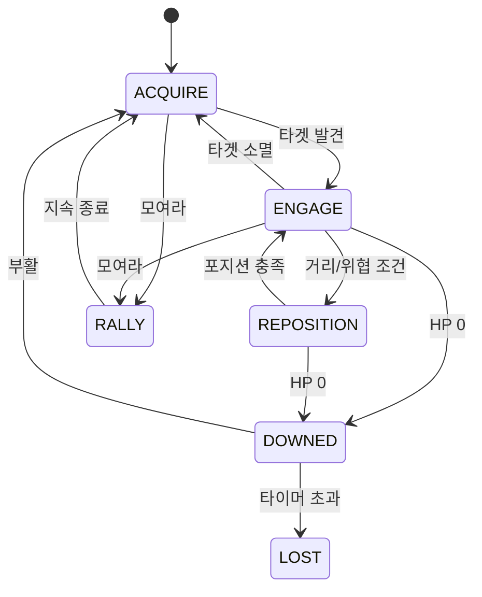

# 02. 동료 AI · 케어 시스템

스탠스 명령을 없앴으므로(D8) **동료는 기본값만으로 똑똑해야 한다.** 이 문서가 그 기본값 전부다. AI 자율성 정책은 D9: **역할대로 교전, 자가후퇴 거의 없음, 생존은 플레이어 책임.**

---

## 1. AI 아키텍처 — 역할 파라미터화 FSM

패턴: 동료마다 **공통 FSM** + **동료 데이터(`CompanionDef`)**. 행동의 "구조"는 코드, "성향 수치"는 데이터(.tres, [05]). 스탯과 역할 튜닝은 **단일 `CompanionDef`에 통합**하고 `role_id`로 거동을 분기한다(D25 — `CompanionRole` 분리 폐기).

공통 상태(state):

| 상태 | 설명 | 전이 조건 |
|------|------|----------|
| `ACQUIRE` | 타겟 탐색 | 항상 → 타겟 있으면 ENGAGE |
| `ENGAGE` | 역할에 맞게 교전(접근/사격/스킬) | 타겟 소멸 → ACQUIRE |
| `REPOSITION` | 역할 포지션 유지(카이팅/전열) | 거리 조건 충족 → ENGAGE |
| `RALLY` | 모여라 발동 중: 무녀로 이동 가중 + 교전 | duration 종료 → ACQUIRE |
| `DOWNED` | 쓰러짐(전투 불가) | 부활 → ACQUIRE / 타임아웃 → LOST |
| `LOST` | 그 런 동안 상실 | (재출전 전까지 복귀 없음) |



> 행동트리 라이브러리 도입 금지(YAGNI). 6상태 FSM이면 충분. 성능상 매 프레임 전체 재평가 대신 `0.1~0.2s` 틱 + 이벤트 전이.

---

## 2. 역할별 정책 (`CompanionDef` 데이터)

D9에 따라 전부 **공격적 교전 / 자가후퇴 없음**. 단 원딜만 카이팅(거리 유지)이 곧 정상 행동.

### 2.1 탱커 — 화랑 호위병
- **타게팅:** 무녀에게 가장 가까운(혹은 가장 밀집한) 적 무리로 전진.
- **포지셔닝:** 무녀/동료와 적 사이에 끼어드는 전열. `engage_range` 근접.
- **특수:** 주변 적 도발(어그로 유도, `taunt_radius` 120px) → 적이 다른 동료 대신 탱커를 노림. 보호의 핵심.
- 카이팅 없음. 받피 흡수.

### 2.2 원거리 딜러 — 활잡이
- **타게팅:** 우선순위 = 정예/보스 > 가장 가까운 위협. 관통/추적 화살.
- **포지셔닝:** **유일하게 카이팅.** 적이 `kite_min`(80px) 안에 들면 무녀 방향으로 후퇴하며 사격(자가후퇴가 아니라 역할 정상 행동).
- 단일 고화력. 보스전 주력.

### 2.3 회복/보조 — 견습 무당
- **타게팅(힐):** 체력 비율 가장 낮은 **아군**(동료/자신). 회복 장판/직접 힐.
- **포지셔닝:** 가장 위험한 동료 근처에 머묾. 전열 뒤.
- **특수:** 정화(장판/디버프 제거), 보호 부적.
- 약한 자가 방어, 주로 무녀의 보호 대상.

### 2.4 광역 제압 — 탈 쓴 퇴마사 *(구현됨, 2026-06-25)*
- **타게팅:** 가장 밀집한 적 군집 중심.
- **특수:** 봉인진(범위 속박), 공포, 저주 확산(광역 디버프). *(쇠사슬 견인/역넉백·범위 속박 등 디버프는 미구현 — 예약)*
- **구현된 거동:** 광역 베기(타겟 주변 `aoe_radius`=90 내 적 다수 동시 피해) + 도발(`taunt_radius` 150) + 받피 감소(`damage_reduction` 0.25, 화랑보다 공격적).

공통 데이터 필드 예시 (단일 `CompanionDef`, D25):

```gdscript
class_name CompanionDef extends Resource
@export var id: StringName = &""            # 파일명과 일치 권장
@export var display_name: String = ""
@export var role_id: StringName = &"tank"   # "tank" | "ranged" | "healer" | "aoe"
@export var max_hp: float = 120.0
@export var move_speed: float = 200.0
@export var attack_damage: float = 8.0
@export var attack_period: float = 0.5      # 공격 주기 s
@export var attack_range: float = 45.0      # 교전/사격 거리
@export var taunt_radius: float = 0.0       # >0 이면 도발(탱)
@export var damage_reduction: float = 0.0   # 받피 감소 비율(탱)
@export var kite_min: float = 0.0           # >0 이면 카이팅(원딜)
@export var heal_per_sec: float = 0.0       # >0 이면 힐(견습무당)
@export var heal_radius: float = 0.0
@export var leash_radius: float = 360.0     # 무녀에서 이 거리 넘으면 복귀 가중↑
@export var target_priority: int = 0        # enum: NEAREST/DENSEST/ELITE/LOWHP_ALLY
@export var self_preserve: bool = false     # D9: 기본 false
```

> `leash_radius`: 자가후퇴는 없지만 무한정 멀어지지도 않게 하는 "고무줄". 너무 멀면 이동 목표에 무녀 가중을 더해 천천히 당김(모여라보다 약하게). 이건 자가보존이 아니라 군집 유지다.

---

## 3. 타게팅/이동 성능 규칙

- 500마리 환경에서 동료가 매 프레임 전체 적을 스캔하면 안 됨. **spatial hash 질의**로 근처 셀만([06]).
- 경로탐색 없음(NavMesh 금지). 적/동료 모두 **직진 + 분리(separation) 스티어링**. 탑다운 호드는 이걸로 충분.
- 동료-적 충돌은 가벼운 분리력만. 동료끼리 겹침 방지 separation.

---

## 4. 케어 — 쓰러짐 (Downed)

동료 HP 0 → 즉사 아님 → `DOWNED`. (DESIGN §10)

| 파라미터 | 시작값 | 비고 |
|----------|--------|------|
| `downed_timer` | 8.0 s | 넋달래기 업그레이드로 연장 |
| 쓰러짐 중 피격 | 무적(혹은 추가 피해 없음) | 즉사 방지 |
| 표시(월드) | 머리 위 카운트다운 링 | 위치 강조(화면 밖이면 가장자리 화살표) |
| 표시(미니맵) | 마커 적색 펄스 + 카운트 링 + 쓰러짐 순간 핑 SFX | 부활 동선 안내, [08]§6.3 |
| 타임아웃 | `LOST` — 그 런 동안 상실 → **화력 감소 + 혼불 수집 효율 저하 디버프**(DESIGN §10). 미니맵 마커는 회색 해골→페이드 | |

---

## 5. 케어 — 부활 (Revive, D13)

무녀가 쓰러진 동료 곁에서 **채널링**. 혼불 전달·오라와 같은 근접 패러다임.

| 파라미터 | 시작값 | 비고 |
|----------|--------|------|
| `revive_range` | 100 px | |
| `revive_channel_time` | 3.0 s (누적, 이탈 시 유지/감쇠) | 채널링 속도 업그레이드 |
| 채널 중 무녀 | 그 자리 근처에 묶임(이동하면 부활 중단) | 트레이드오프 |
| 부활 후 HP | 최대치의 40% | 노브 |
| 중단 규칙 | 거리 이탈 시 **즉시 중단**, 게이지는 천천히 감쇠(혼불 전달과 동일 감성) | |

**핵심 긴장:** 한 명을 구하는 동안 다른 동료가 위험에 빠진다 → 넉백·모여라로 시간을 벌며 우선순위를 판단. 이것이 "동료를 살리는 중요한 선택"(DESIGN §10)의 기계적 구현.

```
동료 HP 0 → 쓰러짐(타이머) → 무녀 근접 채널링 → 게이지 100% → 부활(40% HP)
                                   └ 이탈 시 중단/감쇠
                          → 타이머 초과 시 상실(런 디버프)
```

---

## 6. 구현 체크리스트

- [ ] 공통 6상태 FSM(틱 0.1~0.2s + 이벤트 전이)
- [ ] CompanionDef 데이터(role_id 분기)로 탱/딜/힐 3역할 구동
- [ ] 타게팅 우선순위 4종(NEAREST/DENSEST/ELITE/LOWHP_ALLY)
- [ ] 원딜 카이팅(kite_min), 탱 도발(taunt)
- [ ] separation 스티어링(동료·적), NavMesh 미사용
- [ ] leash 고무줄(무한 이탈 방지)
- [ ] 쓰러짐 타이머 + 머리 위 링 + 화면 밖 화살표 + **미니맵 알림(펄스/카운트/핑)**([08]§6.3)
- [ ] 무녀 근접 채널링 부활(이탈 중단/감쇠) + 미니맵 링 녹색 충전
- [ ] 상실 시 런 디버프 적용 + 미니맵 마커 회색 처리

---

## 구현 현황 (2026-06-25)

**구현됨**
- 공통 FSM(ACQUIRE/ENGAGE/REPOSITION/RALLY/DOWNED/LOST, 0.15s 결정 틱 + 이벤트 전이)과 `role_id` 분기로 탱/딜/힐 3역할 구동.
- **aoe 역할 추가** — 탈 쓴 퇴마사(`talchum`): 광역 베기(타겟 주변 `aoe_radius`=90 내 적 다수 동시 피해), 도발(150) + 받피 감소(0.25).
- 탱 도발(`taunt_radius`, 적 타게팅 오버라이드), 원딜 카이팅(`kite_min`), 힐러 힐(`heal_per_sec`/`heal_radius`), separation 스티어링, `leash` 고무줄(NavMesh 미사용).
- 케어 전체: 쓰러짐 타이머→상실, 무녀 근접 채널링 부활(이탈 중단/감쇠, 부활 HP 40%).

**미구현(후속)**
- `target_priority`: **ELITE만 동작**. DENSEST/LOWHP_ALLY는 최근접(NEAREST)으로 폴백.
- aoe 역할의 쇠사슬 견인(역넉백)·범위 속박 등 디버프(예약).
- 미니맵 쓰러짐 알림: 적색 마커만 표시. 펄스/카운트 링/핑 SFX 미구현.
- 머리 위 카운트다운 링·화면 밖 화살표·근접/광역 공격 시각 연출.
