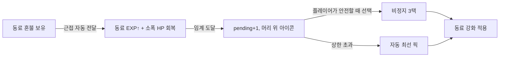

# 03. 혼불 경제 · 성장 · 메타

세 층위의 성장: **런 내 무녀 성장 / 런 내 동료 성장 / 런 간 영구메타.** (D10·D11·D12·D15·D16)

---

## 1. 혼불 2종 (D10)

적 처치 시 드랍. 종류는 적/드랍테이블이 결정(스테이지 데이터, [04]).

| 종류 | 식별자 | 획득 | 효과 |
|------|--------|------|------|
| 무녀 혼불 | `SOULFIRE_MUDANG` | 무녀가 밟으면 **즉시 흡수** → 무녀 EXP | 무녀 레벨업 |
| 동료 혼불 | `SOULFIRE_COMPANION` | 무녀가 밟으면 **보유**, 동료 근접 시 자동 전달 | 전달받은 동료의 **EXP + 소폭 HP 회복**([01]§4) |

드랍 비율: 스테이지 데이터의 `soulfire_ratio`(예: 무녀:동료 = 6:4). 적별 override 가능(엘리트는 동료 혼불 다량 등).

```
적 사망 → drop_table 추첨 → 혼불 스폰
  무녀 혼불: 무녀 픽업 반경 진입 → 자석 흡인 → 무녀 EXP += v
  동료 혼불: 무녀 픽업 → 보유량 += v → (동료 transfer_range 진입 시) 가장 가까운 1동료에게 자동 전달 (EXP + 소폭 HP 회복)
            전달 속도 = transfer_rate_max * clamp(1 - dist/transfer_range, 0, 1)  # 가까울수록 빠름 ([01]§4)
```

자석(pickup magnet) 반경: `pickup_radius` 시작값 70px(업그레이드 ↑). 화면 정리/쾌감용.

---

## 2. 무녀 성장 — 일시정지 3택 (D11·D12)

무녀 EXP가 차면 **게임 일시정지** + 서포터 주술 3택 1. 카드 풀은 [01]§6 카테고리.

- 3택 추첨: 보유 업그레이드의 다음 레벨 + 미보유 신규에서 가중 추첨. 이미 만렙인 항목 제외.
- 리롤(선택): 후속 기능, 슬라이스 제외.
- 한 카드 = `{upgrade_id, level, 효과 델타}`. 데이터는 `MudangUpgrade`([05]).

EXP 곡선(시작값): `exp_to_next(n) = floor(8 * pow(1.15, n-1))`.

---

## 3. 동료 성장 — 비정지 보류 카드 (D11·D12)

동료가 전달받은 혼불로 EXP가 차면 레벨업 → **게임을 멈추지 않고** 그 동료에 "강화 대기"가 적립된다.

흐름:
1. 동료 EXP ≥ 임계 → `pending_upgrades += 1` (게임 진행 유지).
2. 동료 머리 위에 **강화 가능 아이콘** 표시.
3. 플레이어가 안전한 순간(또는 모여라 중) 해당 동료를 탭/근접하면 그 동료 위에 **3택 카드**가 뜸 → 비정지로 선택(시간이 잠깐 느려지는 슬로모 연출은 노브).
4. 미선택이면 계속 적립(상한 노브, 예: 최대 3 대기). 상한 초과분은 자동 최선책 선택(보류 폭주 방지).

| 파라미터 | 시작값 |
|----------|--------|
| 동료 EXP 곡선 | `floor(6 * pow(1.18, n-1))` (동료별 개별 레벨) |
| pending 상한 | 3 (초과 시 자동 픽) |
| 3택 풀 | 동료별 `CompanionUpgrade` 풀(역할 특화) |

> "누구에게 혼불을 먹일까" + "언제 강화를 받을까" = 동료 성장의 이중 전략 레이어.



---

## 4. 출전 편성 (Loadout, D16)

런 시작 전 화면. 해금된 동료 풀에서 **출전 슬롯 수만큼** 선택. 역할 구성이 선택에 따라 달라짐(사용자 확정).

| 항목 | 값 |
|------|----|
| 출전 슬롯 | **시작 2 → 영구메타로 최대 4** |
| 선택 대상 | 해금된 동료(스토리/메타로 해금) |
| 전략 | 탱 없이 딜만, 힐 빼고 공격 편중 등 자유 — 그 대가는 케어 난이도 |

슬라이스 풀(D20): 화랑(탱)·활잡이(딜)·견습무당(힐) 3종 해금 → 슬롯 2~3에서 조합.

> 전체 해금 동료 풀(직업 로스터)과 각 직업의 역할 매핑·세계관 설정은 [12] 참조(D26). 이 문서는 편성/해금 **규칙**의 권위, [12]는 **로스터 내용물**의 권위.

---

## 5. 영구메타 (MetaProgress, D15)

런을 넘어 저장. **가볍게** 유지(스테이지 밸런스를 메타에 종속시키지 않기 위해).

저장 항목:

| 키 | 내용 |
|----|------|
| `unlocked_stages` | 클리어로 해금된 스테이지 id 집합 |
| `unlocked_companions` | 해금 동료 id 집합 |
| `loadout_slots` | 현재 출전 슬롯 수(2~4) |
| `meta_currency` | 런에서 획득하는 메타 재화(예: "원혼 정수") |
| `meta_upgrades` | 소폭 영구 강화(무녀/동료 기초 스탯 +x%, 신규 주술 카드 해금) |

규칙:
- 런 내 빌드(주술 3택, 동료 레벨)는 **매 런 리셋**.
- 영구 강화는 **소폭**으로 상한. 메타가 세지면 스테이지 난이도 설계가 깨짐(D15 거부 사유).
- 저장 포맷: `user://save.json` 또는 `ConfigFile`. 단순 직렬화.

```gdscript
# meta_progress.gd (autoload, 요지)
var unlocked_stages: Array[StringName]
var unlocked_companions: Array[StringName]
var loadout_slots: int = 2
var meta_currency: int = 0
var meta_upgrades: Dictionary  # upgrade_id -> level
func save() -> void  # user://save.json
func load() -> void
```

---

## 6. 런 보상 흐름

```
런 클리어 → 메타 재화 정산(생존시간·동료 생존 수·목표 달성) → 스테이지/동료 해금 판정 → 영구메타 저장
런 실패(동료 전멸) → 부분 메타 재화(진행 비례) → 재도전
```

> "동료 생존 수" 보상은 케어를 메타로도 보상해 D9의 긴장을 강화한다.

---

## 7. 구현 체크리스트

- [ ] 혼불 2종 드랍/픽업/자석, 보유·전달
- [ ] 무녀 EXP/레벨 → 일시정지 3택
- [ ] 동료 EXP/레벨 → pending 적립 → 비정지 3택 + 자동 픽 상한
- [ ] 출전 편성 화면(슬롯 2, 풀 3종)
- [ ] MetaProgress autoload 저장/로드(JSON)
- [ ] 런 정산 → 해금/재화/저장
