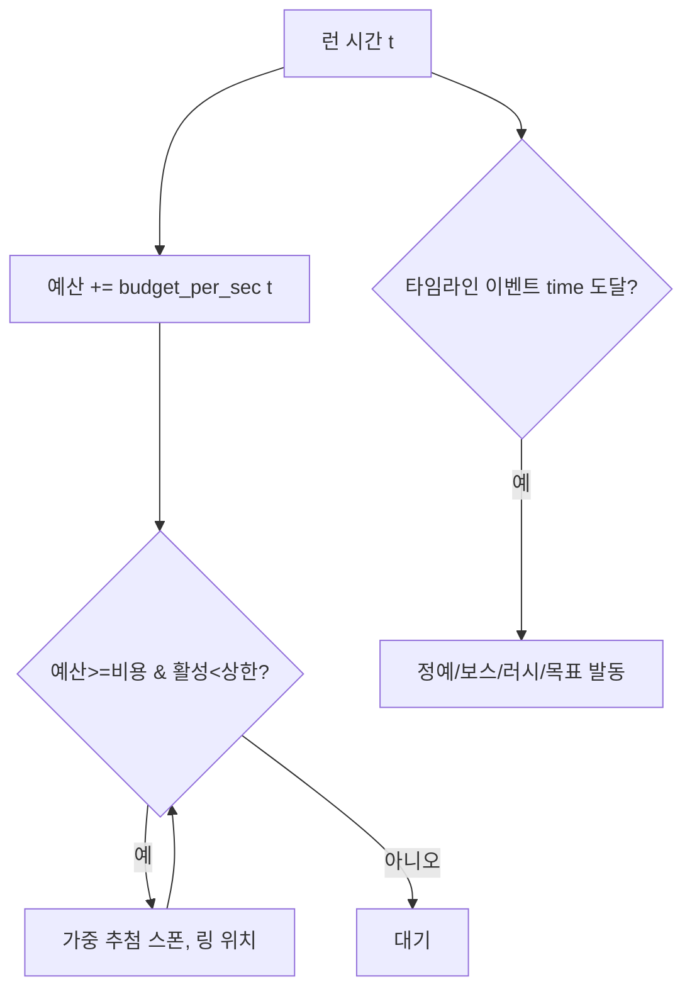

# 04. 적 · 스폰 시스템 · 목표 모듈

런의 "내용물". 스폰은 **하이브리드: 타임라인 골격 + 예산 충전 동적 스폰**(D18). 모든 적/웨이브/목표는 데이터([05]).

---

## 1. 적 로스터 (DESIGN §7 → 구현 스펙)

각 적은 `EnemyDef` 데이터(.tres, [05]). 시작값은 튜닝 대상.

> **위협 모델(D6-a):** 적은 **무녀를 직접 노리지 않는다.** 최근접 **동료** 또는 **거점**을 향한다. 단 **무녀도 HP가 있어**, 경로상 적과 접촉하면 접촉 피해를 받는다(거점·동료와 동일 `contact_damage` 초당). → 무녀는 "피해 다니며" 오라·「물렀거라」로 길을 트고 동료를 지킨다. (무녀만 집요하게 쫓는 적은 두지 않는다 — 동료 케어가 무의미해지므로)

| 적 | 식별자 | 역할(AI) | HP | 속도 | 넉백저항 | 특수 | 슬라이스 |
|----|--------|---------|----|----|--------|------|---------|
| 잡귀 | `mob_low` | 기본 호드, 최근접 동료(일부 거점)로 직진 | 6 | 70 | 0.1 | 수 많음, 끊임없음 | ✅ |
| 처녀귀신 | `ghost_maiden` | **동료를 노림**, 빠른 접근 | 10 | 130 | 0.2 | 동료 우선 타겟 → 넉백/보호 테스트 | ✅ |
| 도깨비 | `dokkaebi` | 둔하지만 강한 엘리트 | 90 | 45 | 0.7 | 강타, 동료 혼불 다량 드랍 | ✅(엘리트) |
| 창귀 | `changgwi` | 돌진, **저HP 동료 우선** | 18 | 150(돌진) | 0.3 | 가속 돌진 | 후속 |
| 역병귀 | `plague` | 독 장판/감염 | 25 | 60 | 0.3 | 장판 디버프(정화로 제거) | 후속 |
| 탈귀 | `mask_spirit` | 원거리 저주/혼란 | 20 | 55 | 0.4 | 원거리 디버프 | 후속 |
| 궁중 원귀 | `royal_wraith` | 후반 보스급 | 보스 | - | 0.9 | 보스 패턴 | 후속(보스) |

슬라이스 보스(1장): 간이 보스 1종(도깨비 강화형 또는 전용 `boss_hwalinseo`). [07] 참조.

`EnemyDef` 핵심 필드:
```gdscript
class_name EnemyDef extends Resource
@export var id: StringName
@export var max_hp: float
@export var move_speed: float
@export var knockback_resist: float = 0.2     # 0~1
@export var contact_damage: float = 4.0       # 접촉당 초당 피해(동료·거점·무녀 공통)
@export var ai_kind: StringName               # "rush_companion"|"target_companion"|"rush_lowhp"|"ranged"|"elite"|"boss" (무녀 직접 추격 없음)
@export var spawn_cost: int = 1               # 예산 스폰용 비용
@export var drop_table: DropTable             # 혼불/메타 재화
@export var sprite_frames: SpriteFrames
@export var level: int = 1                     # 오라 레벨 보정용
```

---

## 2. 스폰 모델 — 하이브리드 (D18)

두 채널이 동시에 돈다.

### 2.1 타임라인 채널 (골격, 결정론적)
스테이지가 정의한 **고정 이벤트**: 특정 시각의 정예 등장, 중간 보스, 막판 러시, 목표 활성. 저작자가 손으로 큰 흐름을 찍는다.

```
TimelineEvent: { time: float, kind: SPAWN_GROUP|MINIBOSS|RUSH|OBJECTIVE|MODIFIER, payload }
```

### 2.2 예산 채널 (충전, 동적)
시간에 따라 증가하는 **스폰 예산**을 적 풀에서 가중 추첨해 소비. 반복 플레이 다양성.

| 파라미터 | 시작값 | 비고 |
|----------|--------|------|
| `budget_per_sec(t)` | `2 + t/30` (분당 +2) | 난이도 곡선 |
| 동시 적 상한 | 500(PC)/250(모바일) | [06] 성능 예산 |
| 스폰 위치 | 화면 밖 링(카메라 가장자리 + 여백) | 화면 안 팝인 금지 |
| 가중 풀 | 시각대별 enemy 가중치(스테이지 데이터) | 후반 강적 비중↑ |

알고리즘:
```
매 틱:
  budget += budget_per_sec(t) * dt
  while budget >= cheapest_enemy.cost and active_count < cap:
     e = weighted_pick(spawn_pool[t])
     spawn(e, ring_position())
     budget -= e.spawn_cost
타임라인 이벤트는 별도로 time 도달 시 무조건 발동(예산 무관)
```



---

## 3. 목표 모듈 (Objective Module, D14)

시간제 생존이 골격, 그 위에 스테이지별 선택적 목표를 **데이터 모듈**로 얹는다. 슬라이스는 시간제 생존 + 목표 1종만 구현.

| 목표 타입 | 식별자 | 승/패 영향 |
|----------|--------|-----------|
| 시간 생존 | `survive_time` | 시간 도달 = 클리어(기본, 항상) |
| 대상 보호 | `defend_target` | 보호 대상(병자/거점) HP 0 = 즉시 패배 |
| 정화 지점 | `purify_zone` | 지점 점거/정화로 보너스/진행 |
| 보스 처치 | `kill_boss` | 보스 처치 = 조기 클리어 |

`StageDef`가 목표 리스트를 가짐(여러 개 조합 가능). 슬라이스 1장: `survive_time`(예: 6분) + `defend_target`(활인서 병자들).

```gdscript
class_name ObjectiveDef extends Resource
@export var kind: StringName    # "survive_time"|"defend_target"|"purify_zone"|"kill_boss"
@export var params: Dictionary  # time, target_hp, zone_rect 등
```

---

## 4. 패배/승리 판정 (슬라이스)

- 승리: `survive_time` 도달 (and 보호 대상 생존).
- 패배: **무녀 사망**(D6-a) **또는** `defend_target` 파괴. (동료 전원 상실은 화력 0의 사실상 게임오버이나 공식 패배 트리거는 무녀/거점)

---

## 5. 구현 체크리스트

- [ ] EnemyDef 데이터 + 적 3종(잡귀/처녀귀신/도깨비) 거동
- [ ] WaveDirector: 타임라인 채널 + 예산 채널 동시
- [ ] 화면 밖 링 스폰, 동시 상한 enforcement
- [ ] DropTable → 혼불 2종 드랍
- [ ] ObjectiveDef: survive_time + defend_target
- [ ] 승/패 판정 연결
