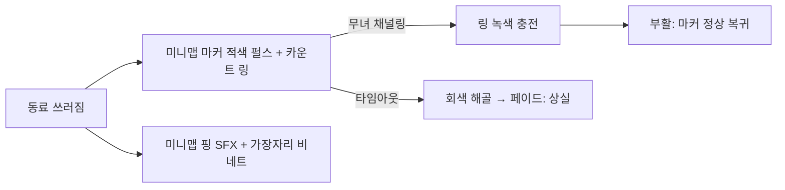

# 08. 아트 · 오디오 방향

DESIGN.md의 방향(조선 무녀 + K-pop 데몬 헌터)이 명확하므로 그릴링 없이 **구현 추천 스펙**으로 정리한다. 2D 탑다운 스프라이트(D2) 제약 안에서 화려함을 낸다.

---

## 1. 비주얼 아이덴티티

- **콘셉트:** 전통 무복 + 현대적 데몬 헌터. 붉은색·검은색·청록색 중심. 댕기·장신구·부적·방울·신칼·부채·장구 모티프.
- **2D로 화려함 확보 전략(3D 없이):**
  - 셰이더 기반 발광/번짐(주술·혼불·오라).
  - 파티클(부적, 영혼불, 베기 잔상).
  - 스프라이트 다단 애니메이션(천 휘날림 프레임).
  - 라이팅: 2D 노멀맵 + 점광원(밤 분위기, 도깨비불).

---

## 2. 아트 에셋 규격

| 항목 | 추천 |
|------|------|
| 무녀/동료/보스 | 개별 `AnimatedSprite2D`, 8방향 or 좌우반전 4방향, 프레임 12~16 |
| 잡몹(호드) | MultiMesh + 아틀라스, 셰이더 프레임 선택([06]). 저프레임(2~4) 허용 |
| 해상도 | 캐릭터 기준 128~192px, 픽셀아트 또는 정밀 일러스트(택1, 일관) |
| 색 팔레트 | 마스터 팔레트 .gpl 고정(붉/검/청록 + 밤 배경 한색) |
| 카메라 | 탑다운 약간의 틸트(2.5D 룩 느낌만, 실제는 2D) — 노브 |

> 스타일(픽셀 vs 일러스트)은 **슬라이스 전 1개 캐릭터로 확정**할 것. 둘을 섞으면 전부 재작업.

---

## 3. 가독성 (호드 서바이벌 필수)

500마리 환경에서 **정보가 묻히면 안 된다.**

| 요소 | 규칙 |
|------|------|
| 동료 | 적과 명확히 구분되는 색/외곽선(아군 외곽 발광) |
| 쓰러진 동료 | 강한 강조 — 머리 위 카운트다운 링 + 화면 밖이면 가장자리 화살표 |
| 오라 | 무녀 발밑 반투명 원(반경 가시화) |
| 넉백 | 클릭 지점 임팩트 링 + 짧은 화면 진동 |
| 혼불 2종 | **색 구분 필수**(무녀=백/금, 동료=청록 등). 전달 시 무녀→동료 궤적선 |
| 적 등급 | 엘리트/보스는 크기·색·외곽으로 즉시 구분 |

---

## 4. 오디오 방향

- **음악:** 국악(장구·태평소·해금) + 현대 비트 융합(K-pop 데몬 헌터 감성). 런 페이즈별 강도 전환(초반 잔잔→막판 고조).
- **SFX:** 방울·신칼·부적 시전음, 넉백 타격감, 혼불 흡수/전달음, 부활 채널 상승음.
- **보이스:** 무녀 짧은 시전 보이스(도발적 성격, DESIGN §5), 동료 위기 외침(케어 신호로도 기능).
- **구현:** `AudioStreamPlayer` 풀(동시 SFX 상한), 거리 기반 볼륨, 음악은 페이즈 크로스페이드.

---

## 5. UI/UX 톤

- 전통 문양 프레임 + 미니멀 현대 HUD.
- HUD 최소 정보: 무녀 레벨/EXP, 모여라 쿨, 출전 동료 체력바(작게, 화면 가장자리), 런 타이머/목표, 쓰러짐 알림.
- 모바일: 좌 조이스틱 / 우 모여라 버튼 / 탭=넉백. UI 요소는 엄지 영역 회피.

---

## 6. 미니맵 (Minimap) · 편의성

케어가 핵심인 게임에서 **"어디서 누가 쓰러졌는가"를 즉시 아는 것**이 편의성의 핵심이다. 미니맵은 화면 밖 동료의 위치/상태를 한눈에 주고, 특히 **쓰러짐/사망 알림**으로 부활 동선을 안내한다.

### 6.1 배치/형태
- 화면 모서리(기본 우상단, 모바일은 엄지 회피해 좌상단 노브). 반투명 전통 문양 프레임.
- 슬라이스 가정: **경계가 있는 아레나** → 미니맵은 **스테이지 전체**를 축소 표시(`mini = (world - arena_origin)/arena_size * mini_size`). 무한/스크롤 맵이면 무녀 중심 반경 표시로 전환(노브).

### 6.2 표시 대상 (의도적으로 최소 — 500마리 다 찍지 않는다)
| 대상 | 표기 | 비고 |
|------|------|------|
| 무녀 | 중심 아이콘(흰/금) + 시야 방향 | |
| 동료 | 역할 색 점(탱/딜/힐 구분) + 상태 테두리 | 위치 항상 표시 |
| 거점(`defend_target`) | 고정 아이콘 + HP색(녹→적) | 피격 시 깜빡 |
| 보스/엘리트(도깨비) | 별도 큰 마커 | 잡귀는 표시 안 함 |
| 잡몹 밀도 | (선택) 격자 셀 음영(coarse heat) | 개별 점 금지, 셀 카운트로 |
| 혼불(동료 혼불 다량) | (선택) 작은 청록 점 | 노브 |

> 적 개별 점을 다 찍으면 노이즈 + 비용. 의미 있는 액터(<20)만 그린다. 밀도가 필요하면 격자 음영으로([06] spatial hash 셀 재활용).

### 6.3 무사 쓰러짐/사망 알림 (요청 기능)
- **쓰러짐(Downed):** 해당 동료 마커가 **적색 펄스 + 카운트다운 링**(남은 부활 시간, [02]§4의 `downed_timer`와 동기). 미니맵 가장자리라면 방향 화살표로 클램프.
- **사운드/연출:** 쓰러지는 순간 미니맵 핑(SFX) + 화면 가장자리 적색 비네트 1회.
- **상실(LOST, 타임아웃):** 마커가 회색 해골로 바뀌고 잠시 후 페이드(그 런 동안 복귀 불가, [02]§4).
- **부활 진행:** 무녀가 채널링 중이면 마커 링이 녹색으로 차오름([02]§5).
- 본문 월드뷰의 "머리 위 링 + 화면 밖 가장자리 화살표"([02]§4)와 **이중**으로 제공 → 화면 안/밖 어디서든 인지.

### 6.4 구현 노트
- `Control` 1개(`MinimapHUD`) + `_draw()`. 매 프레임 액터 위치 읽어 `queue_redraw()`.
- 액터 수가 적어(<20) `_draw` 비용 무시 가능. 밀도 음영만 spatial hash 셀 카운트 참조.
- 상호작용 없음(정보 전용). **미니맵 탭으로 순간이동/핑 금지** — 부활은 물리적으로 달려가야 성립(공간 긴장 보존). 모바일에서 미니맵은 넉백 탭과 겹치지 않게 입력 영역 분리.

---

## 7. 구현 체크리스트(슬라이스 최소)

- [ ] 캐릭터 1종으로 아트 스타일 확정
- [ ] 마스터 팔레트 고정
- [ ] 아군/적/혼불 색 구분 + 쓰러짐 강조
- [ ] 오라/넉백/혼불 셰이더·파티클 1차
- [ ] 음악 1트랙(페이즈 전환) + 핵심 SFX 6종
- [ ] HUD 최소 세트
- [ ] 미니맵: 무녀/동료/거점/보스 마커 + 월드→미니맵 변환
- [ ] 미니맵 쓰러짐 알림(펄스+카운트 링+핑) / 부활 충전 / 상실 표기
