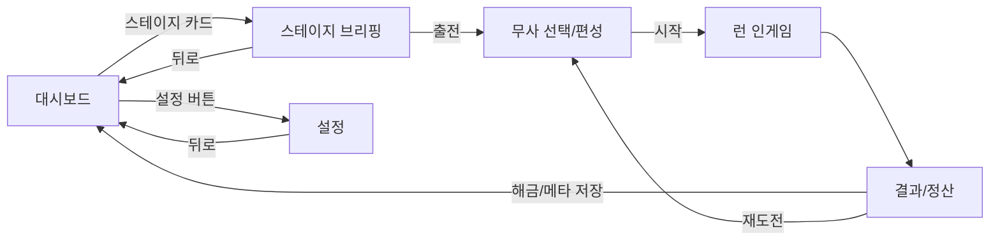

# 10. 대시보드 · 스테이지 선택 · 6 스테이지 설계

대시보드(메인 메뉴) → 스테이지 선택 → 무사(동료) 선택 → 진입의 전체 플로우와, 초기 6 스테이지의 구현 가능 컨셉.

관련 결정(이 문서에서 확정, [00] 결정 로그에 반영):
- **D21** 스테이지 선택 = **세로 리스트/카드 + 선형 해금 + 클리어 후 자유 재도전**.
- **D22** 스테이지 **풀 차별화**: 목표 모듈 + 적 테마 + 보스 + 지형/해저드 + 글로벌 룰 전부 다르게.
- 6 스테이지 = DESIGN.md 6장과 1:1 매핑.

---

## 1. 화면 전이 플로우

```
대시보드 ──탭(스테이지 카드)──▶ 스테이지 브리핑 ──[출전]──▶ 무사 선택(편성) ──[시작]──▶ 런(인게임)
   │                                                                                      │
   └──[설정 버튼]──▶ 설정 화면 ──[뒤로]──▶ 대시보드          런 종료 ──▶ 결과/정산 ──▶ 대시보드
```



씬 구성([06] 연계): `Main` 아래 `DashboardScene` / `RunScene`를 교체. 브리핑·편성·설정은 Dashboard 내 패널(또는 서브 씬).

---

## 2. 대시보드 (메인 메뉴)

### 2.1 레이아웃
```
┌───────────────────────────────────────┐
│ [타이틀/연화 일러스트, 밤 배경]   프로필▶ │  ← 상단: 메타 재화(원혼 정수), 출전 슬롯 수
├───────────────────────────────────────┤
│  ▣ 1장 활인서의 밤        ★★☆  클리어  │
│  ▣ 2장 도성 밖 무녀촌      ★☆☆  클리어  │  ← 중앙: 세로 스크롤 스테이지 카드
│  ▣ 3장 산길의 창귀         –    진행가능 │
│  🔒 4장 양반가의 은밀한 굿        잠김    │
│  🔒 5장 …                        잠김    │
│  🔒 6장 …                        잠김    │
├───────────────────────────────────────┤
│            [ ⚙ 설정 ]                   │  ← 하단: 설정 버튼(요청 사항)
└───────────────────────────────────────┘
```

### 2.2 스테이지 카드 표시 정보
| 요소 | 내용 |
|------|------|
| 썸네일/장 번호/제목 | `StageDef.display_name` |
| 상태 | 잠김 🔒 / 진행 가능 / 클리어 ✓ |
| 최고 기록 | 별점(목표 달성도) 또는 최장 생존/클리어 타임 |
| 핵심 정보(접힘) | 목표 타입 아이콘, 주요 적, 권장 편성 힌트 |
| 동료 해금 배지 | 이 스테이지 첫 클리어 시 해금되는 동료 표시 |

- 잠긴 카드: 회색 + 자물쇠 + "선행 클리어 필요"(선행 스테이지명). `StageDef.unlock_requires`([05])로 판정.
- 정렬: 장 순서 고정. 스크롤.

---

## 3. 스테이지 브리핑 (카드 탭 후)

진입 전 정보 확인 화면. 무지성 진입 방지 + 편성 판단 근거.

| 섹션 | 내용 |
|------|------|
| 서사 한 줄 | 장 도입부 텍스트(DESIGN.md 장 요약) |
| 목표 | 목표 모듈 명시(예: "6분 생존 + 병자 거점 사수") |
| 위협 | 주요 적/보스 아이콘 + 한 줄 경고(예: "탈귀의 저주 주의") |
| 지형/룰 | 해저드·글로벌 룰 안내(예: "안개로 시야 제한") |
| 보상 | 메타 재화, 첫 클리어 동료 해금 |
| 권장 편성 | `StageDef.recommended_roles`(힌트, 강제 아님) |
| [출전] | → 무사 선택 |

---

## 4. 무사(동료) 선택 — 출전 편성

[03]§4 Loadout의 화면 구현. 슬롯 시작 2 → 메타 최대 4(D16).

### 4.1 레이아웃
```
┌───────────────────────────────────────┐
│  출전 편성 — 1장 활인서의 밤             │
│  슬롯: [화랑] [   ] ( /2 )    권장: 탱·힐 │
├───────────────────────────────────────┤
│  해금 동료 풀:                           │
│   [화랑 호위병·탱]  [활잡이·딜]          │
│   [견습무당·힐]     [🔒 탈쓴퇴마사]       │
├───────────────────────────────────────┤
│  선택 동료 정보: HP/역할/스킬 요약        │
│              [ 시작 ]                    │
└───────────────────────────────────────┘
```

### 4.2 규칙
- 해금 동료(`MetaProgress.unlocked_companions`)만 선택 가능. 미해금은 자물쇠.
- 슬롯 수 = `MetaProgress.loadout_slots`. 슬롯 미만 출전 허용(고난도 자율).
- 역할 구성은 플레이어 자유 → 탱 없이 딜만 등 가능(대가는 케어 난이도, D9).
- 권장 편성은 **힌트만**(브리핑의 위협과 연동). 강제하지 않음.
- 동료 미리보기: 기본 스탯([09]) + 보유 동료 업그레이드 풀 요약.

---

## 5. 설정 (Settings)

하단 설정 버튼 → 설정 화면. 표준 카테고리(슬라이스 최소 + 모바일 대비).

| 카테고리 | 항목 |
|----------|------|
| 오디오 | 마스터 / 음악 / 효과음 / 보이스 볼륨 |
| 그래픽 | 품질 프리셋(저·중·고), **동시 적 상한**(성능 노브, [06]/[19]), 화면 흔들림 on/off, 해상도 스케일(모바일) |
| 조작 | PC 키 바인딩 / 모바일 가상 조이스틱 위치·크기 / **미니맵 위치(좌·우)**([08]§6) / 넉백 입력 방식 |
| 게임 | 언어(한국어 기본), 데미지 숫자 표시, 튜토리얼 팁 on/off |
| 접근성 | 색맹 모드(아군·적 구분 강화, [08]§3), 화면 흔들림 끄기, 텍스트 크기 |
| 데이터 | 세이브 초기화, 진행도 보기, 크레딧 |

저장: `user://settings.cfg`(`ConfigFile`). MetaProgress와 분리.

---

## 6. 6 스테이지 설계 (풀 차별화 — 2계층, D22)

각 스테이지 = 장 매핑 + 고유 목표 + 적 테마 + 보스 + 지형/해저드 + 글로벌 룰. 적/보스 식별자는 [04] 로스터 확장.

> **차별화는 2계층(D22) — 무엇이 "데이터"이고 무엇이 "코드"인지 정직하게 구분한다:**
>
> **계층 ① 데이터 축 (도구/`.tres`로 즉시 확장, D4 유지):** 목표 모듈 조합 · 적 테마(spawn_pool/timeline) · 보스 스탯(EnemyDef) · **정적** 지형(배경+장애물) · **정적 해저드존**(사각형+초당피해+타입).
>
> **계층 ② 전용 엔진 기능 (예약 — "데이터"인 척 안 함, 각자 모듈·재사용 가능):** `시야 제한`(라이팅/마스크) · `점거 게이지`(구역 내 아군 수→충전) · `다페이즈 보스`(보스 페이즈 프레임워크). 스테이지 표에 **"필요 시스템"**을 명시 — 해당 시스템이 없으면 그 스테이지는 데이터 축만으로 (덜 화려하게) 성립한다. **스테이지 존재를 시스템에 묶지 않는다.**
>
> **확산 해저드(격자 전파)는 비싸고 재사용 낮아 v1에서 컷** → **정적 해저드존**(데이터, 계층①)으로 대체.
>
> **신규 스키마(→ [05] 확장):** `StageDef.global_rule: StageModifier`(시야 반경 등) · `StageDef.hazards: Array[HazardDef]`(**정적 존** 우선) · `ObjectiveDef` 확장(`defend_target` 다중, `purify_zone`에 `order`).

### 스테이지 1 — 활인서의 밤 (튜토리얼)
| 항목 | 설계 |
|------|------|
| 서사 | 병자들이 밤에 잡귀로 변한다. 견습 무당과 첫 밤을 버틴다. |
| 목표 | `survive_time` 6분 **+** `defend_target`(병자 거점 HP 300, [09]§3) |
| 적 테마 | 잡귀(주력) + 처녀귀신(동료 노림) |
| 보스 | `boss_hwalinseo`(역병에 잠식된 의관 원귀, [09]§2) — 6분 시점 등장 |
| 지형/해저드 | 활인서 실내: 병상=장애물, 좁은 통로(병목). 해저드 없음(학습용) |
| 글로벌 룰 | 없음(기본). **튜토리얼**: 레버 4종 단계적 안내 |
| 동료 해금 | (시작 보유) 견습 무당 |
| 권장 편성 | 탱+힐 |

### 스테이지 2 — 도성 밖 무녀촌
| 항목 | 설계 |
|------|------|
| 서사 | 포졸이 무녀촌을 불태우려 하고 혼란 속 요괴가 몰려든다. 화랑 호위병 합류. |
| 목표 | `survive_time` 7분 **+** `defend_target` **다중**(초가집 3채, 각 HP 200) |
| 적 테마 | 잡귀 + 처녀귀신 + 도깨비(엘리트) |
| 보스 | `boss_dokkaebi_wrath`(분노로 자란 거대 도깨비) |
| 지형/해저드 | 야외 마을. **정적 화재존**(고정 위치 불 장판: 이동 제한+지속 피해) — 계층① 데이터. ~~확산 시뮬~~은 v1 컷 |
| 글로벌 룰 | 다중 거점 분산 → 무녀 포지셔닝 분할 압박 |
| 필요 시스템 | 없음(전부 데이터 축) |
| 동료 해금 | **화랑 호위병**(첫 클리어 시) |
| 권장 편성 | 탱+딜+힐(3슬롯 권장) |

### 스테이지 3 — 산길의 창귀
| 항목 | 설계 |
|------|------|
| 서사 | 역병 근원이 산속 폐사당. 호랑이에게 죽은 자들의 창귀와 맞선다. 활잡이 합류. |
| 목표 | `kill_boss`(호랑이 요괴) **+** `purify_zone`(폐사당 1지점 정화) |
| 적 테마 | **창귀**(돌진, 저HP 동료 우선, [04]) 주력 + 잡귀 |
| 보스 | `boss_tiger`(호랑이 요괴) — 돌진/포효 패턴 |
| 지형/해저드 | 좁은 산길(강한 병목), 절벽 경계 |
| 글로벌 룰 | **시야 제한**(안개/밤, `vision_radius` 축소) → **미니맵 의존도↑**([08]§6와 시너지). 돌진 적을 미니맵으로 미리 인지 |
| 동료 해금 | **활잡이**(첫 클리어 시) |
| 권장 편성 | 딜(보스 저격)+탱 |

### 스테이지 4 — 양반가의 은밀한 굿
| 항목 | 설계 |
|------|------|
| 서사 | 양반가의 굿이 수명을 빼앗는 저주 의식이었다. 조선의 위선과 마주한다. |
| 목표 | `purify_zone`(저주 제단 점거 정화, 게이지 충전) **+** `survive_time` 7분 |
| 적 테마 | **탈귀**(원거리 저주/혼란) + **역병귀**(독 장판) — 디버프 헤비 |
| 보스 | `boss_curse`(저주받은 원귀) — 주기적 광역 저주 |
| 지형/해저드 | 저택(방·문 구조), **독 장판 해저드**(역병귀 생성, 정화로 제거) |
| 글로벌 룰 | 정화 지점을 동료/무녀가 **점거**해야 게이지 충전 → 케어와 점거 사이 분할. **견습무당 정화 가치↑** |
| 동료 해금 | (없음) — 메타 재화 다량 |
| 권장 편성 | 힐(정화)+딜 |

### 스테이지 5 — 성수청의 봉인
| 항목 | 설계 |
|------|------|
| 서사 | 폐지된 성수청 지하의 봉인과 기록. 역병의 근원이 왕실임을 안다. 탈 쓴 퇴마사 합류. |
| 목표 | `purify_zone` **순차 다지점**(봉인진 3곳 순서대로 점거) **+** 그 사이 `survive_time` |
| 적 테마 | 혼합(잡귀·처녀귀신·탈귀·창귀) + 봉인에서 깨어나는 원혼 웨이브 |
| 보스 | `boss_seal_wraith`(봉인된 원귀) |
| 지형/해저드 | 지하 미궁(어둠), **봉인진 구역**(위에서 싸우면 동료 버프 / 적 약화 — 양날) |
| 글로벌 룰 | 봉인 게이지: 시간 내 순차 점거 실패 시 적 강화. **퇴마사(광역 속박) 가치↑** |
| 동료 해금 | **탈 쓴 퇴마사**(첫 클리어 시) |
| 권장 편성 | 광역+힐+탱(4슬롯 권장) |

### 스테이지 6 — 궁궐의 원귀 (최종)
| 항목 | 설계 |
|------|------|
| 서사 | 왕실의 저주 굿이 팔도의 원혼을 깨웠다. 마지막 굿판. |
| 목표 | `kill_boss`(궁중 원귀, **다페이즈**) + 페이즈 사이 대규모 호드 `survive` 러시(클라이맥스) |
| 적 테마 | **전 적종 총출동** + 궁중 원귀 떼 |
| 보스 | `boss_royal_wraith`(궁중 원귀) — 3페이즈, 페이즈별 패턴/소환 |
| 지형/해저드 | 궁궐 밤마당(넓은 개방형), 페이즈별 구역 전환, 복합 해저드 |
| 글로벌 룰 | 최대 난이도, 모든 메커니즘 종합. 동시 적 상한 한계 활용(500) |
| 동료 해금 | (없음) — 엔딩 분기 진입점(엔딩 A/B/C는 후속 콘텐츠) |
| 권장 편성 | 풀 4슬롯 |

### 6.1 차별화 요약(한눈에) — 계층① 데이터 / 계층② 필요 엔진 기능
| 장 | 핵심 목표 | 시그니처 적 | 시그니처 룰/해저드 | 필요 시스템(계층②) |
|----|----------|-----------|------------------|------------------|
| 1 | 거점 사수 | 처녀귀신 | (튜토리얼) | 없음(데이터) |
| 2 | 다중 거점 | 도깨비 | **정적** 화재존 | 없음(데이터) |
| 3 | 보스+정화 | 창귀 돌진 | 시야 제한(미니맵) | `시야 제한` |
| 4 | 점거 정화 | 탈귀/역병귀 | **정적** 독장판·저주 | `점거 게이지` |
| 5 | 순차 점거 | 봉인 원혼 | 봉인진 양날 구역 | `점거 게이지` |
| 6 | 다페이즈 보스 | 전 적종 | 개방형·복합 | `다페이즈 보스` |

> 계층② **전용 시스템은 단 3종**(시야 제한·점거 게이지·다페이즈 보스)으로 수렴 — 점거 게이지는 4·5장 공용. 각 시스템이 만들어지기 전에도 해당 스테이지는 계층①(목표·적·보스·정적 지형/해저드)만으로 성립한다.

---

## 7. 데이터/구현 메모

- 6 스테이지는 전부 `StageDef.tres`([05]) 6개 + 신규 적/보스 `EnemyDef`. **계층①은 데이터만으로 완성**(D4 유지).
- 슬라이스([07])는 **스테이지 1만** 완성 → 2~6장은 계층① 데이터로 채우는 후속. 계층② 시스템은 별도 엔지니어링 일감으로 스케줄.
- **계층② 신규 시스템은 3종만**(슬라이스 이후, 각 모듈·재사용): `시야 제한`(라이팅/마스크) · `점거 게이지`(구역 내 아군 수→충전, 4·5장 공용) · `다페이즈 보스`(보스 페이즈 프레임워크).
- ~~확산 해저드(격자 전파)~~ → **v1 컷**, 정적 해저드존(`HazardDef`, 데이터)으로 대체.
- 대시보드/브리핑/편성/설정은 `Control` UI. 스테이지 목록은 `StageDef` 디렉토리 스캔 + `unlock_requires` 판정.

---

## 8. 구현 체크리스트

- [ ] DashboardScene: 스테이지 카드 리스트(스캔+해금 판정) + 하단 설정 버튼
- [ ] 스테이지 브리핑 패널(목표/위협/지형/보상/권장편성)
- [ ] 무사 선택(편성) 화면 — 해금 풀 + 슬롯 + 미리보기
- [ ] 설정 화면 6 카테고리 + `user://settings.cfg`
- [ ] 화면 전이(대시보드↔브리핑↔편성↔런↔결과)
- [ ] StageDef 6개 작성(슬라이스는 1번만 완성)
- [ ] (후속) StageModifier/HazardDef 스키마 + 확산/시야/점거/다페이즈 시스템
